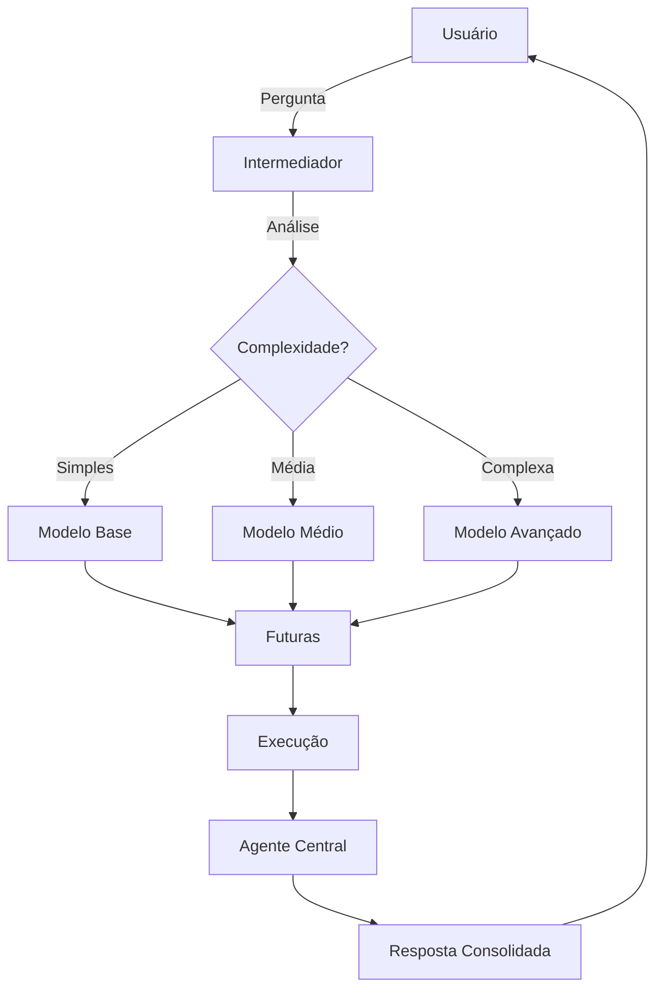

# 🔄 Nova Arquitetura de Agente Inteligente

## 🎯 Objetivo Principal
Criar um sistema modular e resiliente que permita conversas naturais com múltiplos agentes especializados, garantindo escalabilidade e tolerância a falhas.

## 🏗️ Arquitetura em Camadas

### 1. **Intermediador de Conversação** (ex-Supervisor)
- **Função**: Abstrair completamente a comunicação entre agentes
- **Comportamento**: Atua como uma "central telefônica" inteligente
- **Benefício**: Usuário interage com uma única entidade, sem precisar saber quais agentes estão envolvidos

### 2. **Agente Central de Respostas**
- **Responsabilidade**: Consolidar todas as respostas dos sub-agentes
- **Entrega**: Apresenta informações de forma contextualizada e coerente
- **Processo**: Recebe → Organiza → Síntese → Entrega

## 🧠 Hierarquia de Modelos

| Modelo | Capacidade | Rate Limit | Uso |
|--------|------------|------------|-----|
| **Base** | Gemini 2.5 Flash Lite | 60 req/min | Tarefas simples e rápidas |
| **Médio** | Gemini 2.5 Flash | 30 req/min | Tarefas moderadas |
| **Avançado** | Gemini 2.5 Pro | 10 req/min | Tarefas complexas e críticas |

### 🔍 Lógica de Seleção
- **Critério**: Complexidade da tarefa → Define modelo → Modelo escolhe ferramenta
- **Flexibilidade**: Qualquer modelo pode usar qualquer ferramenta disponível
- **Restrição**: Modelos não podem "pular" para APIs de níveis diferentes

## ⚡ Sistema de APIs com Failover

```
┌─────────────────┐
│   API-Base      │ ← 60 req/min
└────────┬────────┘
         │ (falha)
┌────────┴────────┐
│   API-Base-2    │ ← Backup imediato
└─────────────────┘

┌─────────────────┐
│   API-Medio     │ ← 30 req/min
└────────┬────────┘
         │ (falha)
┌────────┴────────┐
│   API-Medio-2   │ ← Backup imediato
└─────────────────┘
```

### 🔄 Mecanismo de Troca Automática
1. Monitor contínuo de rate limit
2. Troca instantânea para API de backup
3. Sem interrupção para o usuário
4. Log detalhado de todas as trocas

## 🔧 Extensibilidade do Sistema

### Princípios de Design
- **Plug-and-Play**: Novas ferramentas com mínima codificação
- **Isolamento**: Ferramentas funcionam independentemente
- **Integração**: Sempre aguardam instruções do modelo apropriado

### Fluxo de Adição de Nova Ferramenta
```markdown
1. Registrar ferramenta → 2. Definir triggers → 3. Teste automatizado → 4. Produção
```

## 🎪 Fluxo Completo de Uso



## 🛡️ Resiliência e Monitoramento

### Alertas Automáticos
- Rate limit próximo (80% capacidade)
- Falha de API
- Tempo de resposta anormal
- Erros de ferramenta

### Métricas em Tempo Real
- Utilização por modelo
- Taxa de sucesso por ferramenta
- Tempo médio de resposta
- Distribuição de complexidade das tarefas